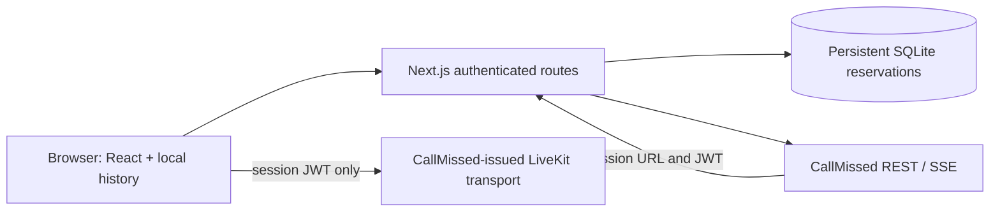

# Svara Studio

A multilingual creative workspace built for the CallMissed AI & Voice Pipeline Intern take-home. Chat, approve an image brief, or start a browser voice session. All AI requests go through CallMissed.

## Local setup

Use Node 22. Install with `npm ci`, copy `.env.example` to `.env.local`, and set a server-only CallMissed key, reviewer code and random session secret. Confirm prior key spend before setting `APP_LIMIT_CENTS` and enabling `LIVE_ENABLED=true`. Start with `npm run dev` and open http://localhost:3000. Production: `npm run build && npm start`.

Native SQLite requires a compatible Node ABI. If you change Node versions, reinstall dependencies or run `npm rebuild better-sqlite3`. Install scripts for SQLite and esbuild are explicitly allowed in package.json.

## What works

- Real SSE chat with bounded conversation context, Markdown, copy, cancellation and local sessions.
- GPT Image 2 generation after explicit approval; inline preview and download.
- Server-created LiveKit voice sessions with Sarvam speech, mute/end controls, transcripts and a 60-second provider limit. REST creation and cleanup tested; live microphone/audio remains to be verified.
- English/Hindi café campaign scenario; explicit copy of assistant output into an editable image brief.
- Reviewer access cookie, fixed models, validation, request timeouts, durable rate limits and atomic spending reservations.

## Architecture

`app/page.tsx` holds the workspace. `lib/provider.ts` is the fixed-origin provider boundary. `lib/ledger.ts` owns atomic reservations. `lib/auth.ts` signs reviewer sessions. API routes validate inputs and reserve before sending requests. No external auth, analytics, AI or database API is used.

## Privacy and tradeoffs

Local history, prompts, transcripts and images use browser localStorage (up to 12 sessions). Clearing local sessions does not erase provider-side records. This app does not record raw microphone audio. CallMissed processes audio and may retain transcripts. Voice starts with fresh context; there is no implied seamless voice/text memory. Voice events are copied into the visible local session, and users can explicitly send text onward.

Images can fill browser storage; download important outputs. Fixed models and sizes keep the demo small. SQLite requires one persistent host; ephemeral serverless filesystems are unsuitable. The hosted demo is not ready until its durable storage and live voice have been verified.

## Verification and delivery

Run `npm test`, `npm run typecheck`, `npm run build`, and `npm audit`. Tests use provider mocks except the separately documented live smoke checks. See [testing](docs/testing.md), [API capabilities](docs/api-capabilities.md), [budget](docs/budget.md), [deployment](docs/deployment.md), and [walkthrough](docs/walkthrough.md).

Hosting: pending an eligible account with persistent storage. AWS credentials in the development environment cannot inspect EC2 or verify Free Tier eligibility. No paid resources were created. See PROJECT-STATUS.md for remaining work. Submission draft is in docs/submission-email.md; it has not been sent.
